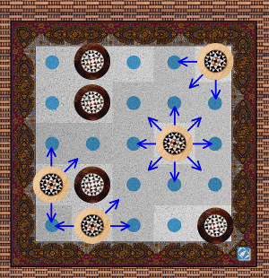
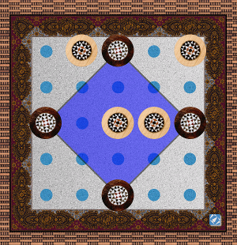
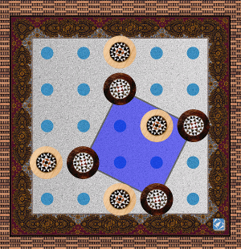

  Cala Mondrago
=============

* _Start an online_ __Mondrago__ _session on_ http://omerkel.github.io/Cala_Mondrago/html5/src
* <em>Also published in</em> 
* <em>Android APK available for install</em>  http://omerkel.github.io/Cala_Mondrago/apk/mondrago-0.3.apk
    * required minimum Android 4.4.2 (API-19)
* <em>Runs in various browsers on</em>
    * <em>desktop systems like BSDs, Linux, Win, MacOS and</em>
    * <em>mobile platforms like Android, FirefoxOS, iOS.</em>

__Keywords, Categories__ _Board Games, Games/Entertainment, Mobile, Abstract Game, Perfect-Information, 2-player Strategy Game_

Rules
-----

Mondrago is a two player abstract perfect-information strategy board game.

<table>
  <tr><td></td></tr>
  <tr><td>Initial board set up.</td></tr>
</table>

* Players alternate turns on each move.
* Each turn consists in moving an own pawn to an adjacent unoccupied field.
* Objective is to form <em>any sized</em> exact square by own pawns. A square may be directed straight, diagonal, or oblique.
* Player wins immediately on reaching the objective.

<table>
  <tr><td></td></tr>
  <tr><td>Available moves for light pawns.</td></tr>
</table>

The diagram shows a sample situation of an ongoing game.
The arrows indicate all legal moves available for the player
controlling the light pawns.

The objective of a Mondrago game in more detail will explain the differences on straight, diagonal, or oblique squares that have to be formed by own pawns.

<table>
  <tr><td></td></tr>
  <tr><td>Light straight small square wins.</td></tr>
</table>

If edges of the winning square run exactly parallel towards the
board edges the winning square is called a <em>straight Mondrago</em>.
There are four different sizes of <em>straight Mondrago</em> winning squares.
Here the light pawns form a winning three by three sized Mondrago.

<table>
  <tr><td></td></tr>
  <tr><td>Dark diagonal huge square wins.</td></tr>
</table>

Just two sizes of a Mondrago exist on <em>diagonal</em> justification.
There are nine possible smaller <em>diagonal Mondrago</em> squares, too, and a huge one
as shown here built by the dark pawns this time.

<table>
  <tr><td></td></tr>
  <tr><td>Dark oblique small square wins.</td></tr>
</table>

<em>Oblique Mondrago</em> squares exist in two sizes, too.
Here dark built a small variant to win the game.

<em>Mind there are exactly 50 different constellations to win a 'Mondrago'.
A player wins even if the opponent's pawns may be placed on edges
or inner fields of any Mondrago.</em>

The Mondrago board game rules are available from the application menu. Furthermore the rules can be found inside the [Rules section](http://mondrago.net/?page_id=32) of the Mondrago community website. The rules text has been translated to various languages already.

|  |  |  |
| --- | --- | --- |
| Mondrago on 15.6inch tablet (Akoya S6114T), own work, Oliver Merkel,  This work is licensed under a <a rel="license" href="http://creativecommons.org/licenses/by-nc-sa/4.0/deed.en_US">Creative Commons Attribution-NonCommercial-ShareAlike 4.0 International License</a>. | Non electronical version of my own Mondrago, own work, Oliver Merkel,  This work is licensed under a <a rel="license" href="http://creativecommons.org/licenses/by-nc-sa/4.0/deed.en_US">Creative Commons Attribution-NonCommercial-ShareAlike 4.0 International License</a>. | Print-and-Play Mondrago game board, own work, Oliver Merkel,  This work is licensed under a <a rel="license" href="http://creativecommons.org/licenses/by-nc-sa/4.0/deed.en_US">Creative Commons Attribution-NonCommercial-ShareAlike 4.0 International License</a>. |

Mondrago Community
------------------

In case of questions or if you simply want to be updated on further research and development or community activities on Mondrago, please visit the [Mondrago community website](http://mondrago.net), too.

|  |  |
| --- | --- |
| Mondrago on an FxOS Geeksphone Peak, own work, Oliver Merkel,  This work is licensed under a <a rel="license" href="http://creativecommons.org/licenses/by-nc-sa/4.0/deed.en_US">Creative Commons Attribution-NonCommercial-ShareAlike 4.0 International License</a>. | left: Mondrago HTML5 version, 2014, on Geeksphone Revolution, FirefoxOS. right: Mondrago Deluxe Edition, 1992, U-Boot-Verlag, Berlin. Mind if running out of batteries the 22 years older version will still work, Oliver Merkel,  This work is licensed under a <a rel="license" href="http://creativecommons.org/licenses/by-nc-sa/4.0/deed.en_US">Creative Commons Attribution-NonCommercial-ShareAlike 4.0 International License</a>. |

Links
-----

The non electrical Mondrago board game is originally created and published by Adrian Schacker in 1992. See the Mondrago community website for the original rules in text format translated into various languages.

* [Cala Mondrago for various devices and operating systems Web Site](https://github.com/OMerkel/Cala_Mondrago)
* [Mondrago at Firefox Marketplace](https://marketplace.firefox.com/app/mondrago/)
* [Mondrago at BoardGameGeek](http://boardgamegeek.com/boardgame/111396/mondrago)
* [Mondrago at VideoGameGeek](http://videogamegeek.com/videogame/137897/mondrago)
* Yet another older [Cala Mondrago for Android Web Site](http://sourceforge.net/p/calamondrago)
* [Mondrago community website](http://mondrago.net/)

Contributors / Authors
----------------------

<table>
  <tr>
    <td>
Oliver Merkel,  This image is licensed under a <a rel="license" href="http://creativecommons.org/licenses/by-nc-nd/4.0/">Creative Commons Attribution-NonCommercial-NoDerivatives 4.0 International License</a>.    
    

    </td>
    <td width="40%"></td>
  </tr>
</table>

_All logos, brands, and trademarks mentioned belong to their respective owners._

Thank you very much to Adrian kindly supporting our open source project by allowing us to use the original logo, name, and logo color scheme.
